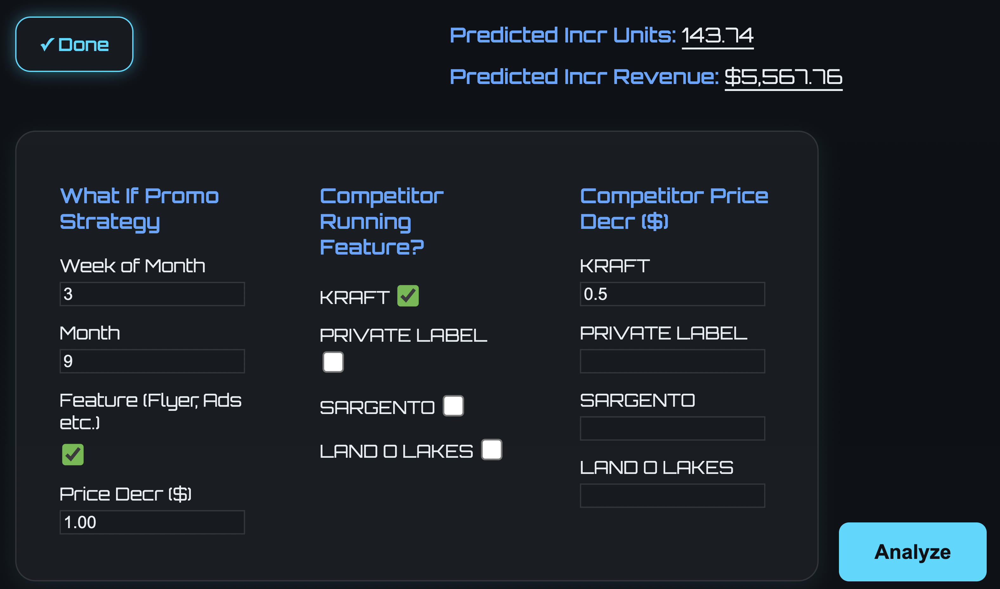

# Trade Promotion Analytics 📈

A machine learning tool designed to help businesses determine the optimal timing and impact of promotional campaigns on sales and revenue.

🏆 **Award-Winning Project:** This project was the winner of the Wisconsin Tech Exploration Lab’s industry showcase, receiving a $1,000 scholarship for its innovative and impactful solution.

---

## About The Project

This project was developed in collaboration with **Cub Foods** and **Crystal Farms Dairy Company** to solve a real-world business challenge: *When is the best time to run a promotion, and what is the true impact on the bottom line?*

Instead of relying solely on manual analysis, this tool leverages a custom machine learning pipeline powered by Google's Gemini model through Vertex AI. It analyzes historical sales data and external factors to provide data-driven predictions, empowering regional businesses to unlock strategic, high-ROI promotion strategies without needing a massive data science team.

---

## Key Features

* **🤖 Predictive ML Model:** A custom 3-layer ML pipeline that outperforms the native Gemini model by 10-15%.
* **💡 "What-If" Analysis:** A simple and intuitive web interface for business users to simulate promotional scenarios.
* **🔧 Modular & Scalable:** The system is built to be easily adapted for other products or business scenarios.
* **📊 Data-Driven Strategy:** Helps transform business decision-making from manual intuition to precise, data-backed strategy.

---

## Tech Stack

* **Backend:** Python
* **AI/ML:** Google Gemini, Vertex AI
* **Frontend:** HTML, CSS, JavaScript
* **Cloud:** Google Cloud Platform

---
## Acknowledgments
* Wisconsin Tech Exploration Lab

* Cub Foods

* Crystal Farms Dairy Company

* Teammates: Albert Wu, Alec Bhamani, Eric Cao, Adhviklal Thoppe, Isaac Anderson(myself)
---
## Image of Application

---
ALL DATA HIDDEN
